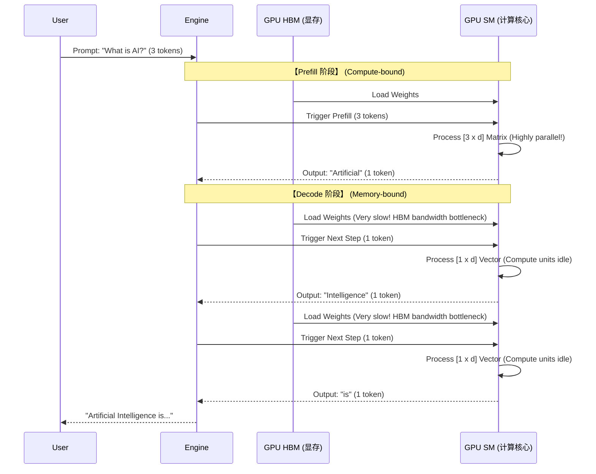

# Chapter 1: 从零理解 LLM 推理与性能瓶颈 (Foundations & Bottlenecks)

要写出一个优秀的推理引擎，我们必须先知道大语言模型 (LLM) 推理到底是个什么过程，以及它为什么会慢。许多人认为推理无非就是把训练好的模型拿来“跑一遍前向传播 (Forward Pass)”。但在 LLM 领域，这只说对了一半。

LLM 的生成过程是一个**循环**，并且在这个循环的不同阶段，硬件面临的性能瓶颈是完全不同的。

---

## 1.1 推理的本质：自回归生成 (Autoregressive Generation)

我们常说的“大语言模型”通常属于**Decoder-only**架构（例如 GPT 系列、Llama 等）。这种模型在生成文本时遵循一个核心数学范式：**自回归**。

自回归的意思是：模型**每次只能预测下一个词 (Token)**。它的数学表达是：给定前 $t$ 个词 $x_{1:t}$，模型计算出第 $t+1$ 个词 $x_{t+1}$ 的概率分布 $P(x_{t+1} | x_1, x_2, ..., x_t)$。

一旦预测出一个新的 Token，这个 Token 就会被拼接到原来的输入序列后面，作为新的上下文 (Context) 再次喂给模型，用来预测下下个词。如此循环往复，直到模型输出了一个特殊的结束符（如 `<EOS>`）或者达到了设定的最大长度。

我们用一句话来举例：输入 Prompt 是 `"The quick brown"`。

1.  **Step 1**: 输入 `["The", "quick", "brown"]` $\rightarrow$ 模型输出各个词的概率，我们采样得到 `"fox"`。
2.  **Step 2**: 输入拼接为 `["The", "quick", "brown", "fox"]` $\rightarrow$ 模型预测出 `"jumps"`。
3.  **Step 3**: 输入拼接为 `["The", "quick", "brown", "fox", "jumps"]` $\rightarrow$ 模型预测出 `"over"`。

在这个过程中，你有没有发现一个巨大的计算浪费？
在 Step 2 处理 `"The", "quick", "brown", "fox"` 时，前三个词 `"The", "quick", "brown"` 的内部状态（比如特征向量）实际上在 Step 1 已经计算过了！如果不做优化，每次生成新词都要把整段历史重新算一遍，计算复杂度将高达 $O(N^2)$，这是无法接受的。

---

## 1.2 阶段拆解：Prefill (预填充) vs Decode (解码)

为了优化上述问题，所有的现代推理引擎都将推理过程硬生生地劈成了两个截然不同的阶段：**Prefill** 和 **Decode**。

### 阶段一：Prefill (预填充阶段)

当你把一句很长的话（比如 1000 个 Token 的 Prompt）发给模型时，模型的第一步是消化这 1000 个词的上下文，并吐出第 1001 个词。

*   **输入特征**：一次性输入一个长度为 $N$ 的序列。
*   **计算特征**：此时的计算是大矩阵乘以大矩阵（MatMul）。在注意力机制（Attention）中，是 $N \times d$ 的矩阵与 $d \times d$ 的权重矩阵相乘。
*   **瓶颈定位：Compute-bound (计算瓶颈)**。
    *   GPU 的核心是由成千上万个流多处理器 (SM) 和 Tensor Core 组成的。在 Prefill 阶段，由于矩阵维度很大，这些计算单元会被塞得满满的。
    *   此时，决定推理速度的主要是你 GPU 的 **算力 (TFLOPS)**。显存读取速度虽然也很重要，但它不是最卡脖子的地方。

### 阶段二：Decode (解码阶段)

当第一个词生成后，我们就进入了漫长且重复的 Decode 阶段。在这个阶段，为了避免重复计算，我们利用了之前提到的优化手段（即下一节将详细讲解的 KV Cache），因此每次我们**只需要喂给模型最新生成的那 1 个 Token**。

*   **输入特征**：每次输入长度为 $1$ 的序列。
*   **计算特征**：此时的计算退化成了向量乘以大矩阵（Vector-Matrix Multiplication, GEMV）。通常是 $1 \times d$ 的向量去乘以 $d \times d$ 的权重矩阵（通常重达几十甚至上百 GB）。
*   **瓶颈定位：Memory-bandwidth-bound (显存带宽瓶颈)**。
    *   想象一下，为了计算这仅仅 $1$ 个 Token，GPU 必须把几百 GB 的模型权重从显存中搬运到计算核心里。
    *   这就像是用一个极细的吸管去吸一大桶水。GPU 的计算单元大部分时间都在**干等**，等待数据被慢吞吞地搬过来。
    *   此时，决定推理速度的主要是你 GPU 的 **显存带宽 (Memory Bandwidth, 比如 H100 是 3.35 TB/s)**，而不是它的算力。

> **💡 延伸科普：数据在硬件中的流动路线**
> 
> 在探讨显存瓶颈前，我们需要理清不同硬件的内存层级与数据流动路线。
> 
> 1. **CPU 的数据流动**：硬盘 (SSD) $\rightarrow$ 系统主存 (RAM/DRAM) $\rightarrow$ CPU 缓存 (L3/L2/L1 Cache，这是集成在 CPU 硅片内部的 **SRAM**，极小但极快) $\rightarrow$ 寄存器 (Registers) $\rightarrow$ 算术逻辑单元 (ALU) 进行计算。
> 2. **GPU 的数据流动**：硬盘 $\rightarrow$ 系统主存 (RAM) $\rightarrow$ [通过 PCIe/NVLink 总线] $\rightarrow$ **GPU 显存** $\rightarrow$ **GPU 片上缓存 (L2/L1 / 共享内存，也是 SRAM)** $\rightarrow$ 寄存器 $\rightarrow$ 核心 (CUDA Cores / Tensor Cores)。
>    * *注：**VRAM (Video RAM)** 是传统消费级显卡（打游戏用的）上对显存的叫法，比如 GDDR6。而在数据中心级的 AI 显卡（如 H100、A100）上，由于使用了 3D 堆叠封装技术，显存的带宽被拔高了几个数量级，因此被专称为 **HBM (High Bandwidth Memory)**。广义上，VRAM 和 HBM 都是我们常说的“显存”。*
> 3. **TPU 的数据流动**：类似 GPU，但 TPU 的架构设计中**极大地强化了 SRAM (通常称为 HBM 与巨量片上内存)**。TPU 使用脉动阵列 (Systolic Array) 架构，数据一旦进入计算阵列，就会在阵列内部像接力一样传递计算，极大减少了中间结果写回显存的次数。
> 
> 在 Decode 阶段，导致瓶颈的那根“极细的吸管”，指的就是从 **GPU 显存 (HBM) 到 GPU 片上缓存 (SRAM)** 的这层数据搬运。
> 
> ---
> 
> **🤔 进阶思考一：数据最后还得从总线来，整体速度不还是被 PCIe 卡死了吗？**
> 
> 你可能会问：主板上最顶级的 PCIe 5.0 x16 总线带宽也就 64 GB/s 左右，模型权重是从硬盘$\rightarrow$RAM$\rightarrow$总线过来的，那 HBM 的 3,350 GB/s 有什么意义？
> 
> 这里涉及到一个核心概念：**数据的生命周期（Load Once, Read Many Times）**。
> 当你在终端里敲下 `engine = LLM("./gpt-oss-120b")` 启动服务时，66.5GB 的模型权重确实需要排着队，慢吞吞地经过 64 GB/s 的 PCIe 总线爬进 HBM 显存。这可能需要花费两三秒的时间。在这个“冷启动”阶段，系统确实是被总线卡死的。
> 但这只发生**一次**！一旦权重躺进了 HBM 里，在接下来几小时、几天的疯狂推理中，不管你生成了几十万个 Token，模型权重都**不再需要跨过主板总线了**。它只在 **HBM $\rightarrow$ 芯片核心 (SRAM)** 这条内部的“超级高速公路”上狂奔，此时它享受的就是 3,350 GB/s 的全速带宽。
> 
> **🤔 进阶思考二：既然能做到 3,350 GB/s 这么快，为什么主板总线不用这个技术？**
> 
> 答案在于**物理距离**与**引脚数量的暴力美学**。
> *   **PCIe 总线**：为了支持插拔（模块化），主板上必须拉长长的铜线连接 CPU 和远离它的显卡插槽。因为距离长（十几厘米），为了防止高频信号的干扰衰减，PCIe x16 只有 **16 条**物理数据通道。只能靠拼命拉高频率来传输数据。
> *   **HBM (High Bandwidth Memory)**：它不是插在主板上的！它是和 GPU 计算芯片**直接被焊死（封装）在同一块微小的硅片（中介层）上的**。因为距离不到 1 毫米，它可以极其暴力地并排拉出 **数千条**数据通道（比如 HBM3 位宽达 8192-bit）。
> 
> HBM 是牺牲了“可插拔性”，用晶圆级的物理微缩工艺，强行换来的算力生命线。



---

## 1.3 最大的痛点：KV Cache 的诞生与代价

回到我们在 1.1 节提出的问题：如何避免重复计算历史 Token？答案是 **KV Cache (Key-Value Cache)**。

### KV Cache 的原理

在 Transformer 模型的注意力机制 (Attention) 中，每个词的输入数据会被乘以三个权重矩阵，投影为 **Q (Query)**、**K (Key)**、**V (Value)** 三个向量。
*   **Query**：代表“我当前想要寻找什么信息”。
*   **Key**：代表“我包含什么信息”。
*   **Value**：代表“我实际的内容是什么”。

在 Decode 阶段处理第 $t+1$ 个词时，它的 $Q_{t+1}$ 必须和前面所有词的 $K_{1:t}$ 计算相似度（点积），然后按相似度加权求和 $V_{1:t}$。
既然前面词的 $K$ 和 $V$ 在它们生成后就**固定不变了**，我们干脆在它们第一次生成时，就把它们**存储在显存中**。

有了 KV Cache 后，在 Decode 阶段，针对新词 $x_{t+1}$：
1. 算出它的 $Q_{t+1}, K_{t+1}, V_{t+1}$。
2. 将 $K_{t+1}, V_{t+1}$ 塞进 Cache。
3. 拿 $Q_{t+1}$ 去和 Cache 里完整的 $K_{1:t+1}$ 做注意力计算。

这就将每步的计算复杂度从 $O(N^2)$ 降到了 $O(N)$。

### KV Cache 显存容量的数学计算

天下没有免费的午餐。KV Cache 用空间换取了时间，但也带来了现代 LLM 推理最头疼的问题：**显存占用爆炸**。模型参数是固定的，但 KV Cache 随序列长度和并发请求数动态增长。

让我们直接在代码中看看这笔账是怎么算的。打开 `llm.py`，看看 SimpleLLM 在初始化引擎时是如何计算 KV Cache 大小的：

```python
# llm.py (第 54-61 行) 引擎初始化阶段的显存计算

# Compute maximum concurrent sequences based on available GPU memory after model weights.
# Formula: KV cache size = 2 (K+V) × num_kv_heads × head_dim × 2 (bytes for bf16) × num_layers × tokens
# The 66.5GB is empirically measured model weight footprint on H100 (MXFP4 quantized MoE).

gpu_memory_gb = torch.cuda.get_device_properties(0).total_memory / (1024**3)

# 计算【每一个 Token】所需要的 KV Cache 字节数
kv_bytes_per_token = 2 * self.config.num_key_value_heads * self.config.head_dim * 2 * self.config.num_hidden_layers

# 减去模型权重和系统开销 (66.5GB) 剩下的就是留给 KV Cache 的空间
available_memory = (gpu_memory_gb - 66.5) * (1024**3)

# 动态计算在给定的最大序列长度 (max_seq_len) 下，我们最多能支持多少个并发请求 (max_num_seqs)
self.max_num_seqs = min(max_num_seqs, max(1, int(available_memory / kv_bytes_per_token) // max_seq_len))
```

我们把 SimpleLLM 支持的 `gpt-oss-120b` (1200 亿参数) 的真实参数代入这个公式：
*   K和V：需要存 2 份。
*   KV 头数 (`num_kv_heads`): 8 （使用了 GQA 分组查询注意力技术）。
*   每个头的维度 (`head_dim`): 64。
*   数据类型: bfloat16 (每个数值占 2 个字节)。
*   层数 (`num_hidden_layers`): 36。

**每一个 Token** 消耗的 KV Cache 显存大小 = 
`2 × 8 × 64 × 2 × 36 = 73,728 Bytes (约 72 KB)`

如果我们在 H100 上想要支持 64 个用户同时请求 (Batch Size = 64)，且每个用户生成 4096 个 Token，我们需要：
`72 KB × 4096 × 64 = 18.8 GB` 的显存！

加上模型本身 66.5GB 的权重，这就刚好塞满了 H100 的 80GB 显存。
`llm.py` 中这一小段不起眼的数学计算，是保证系统在高并发下绝对不会 **OOM (Out of Memory)** 的安全基石。

现在我们知道，GPU 推理的大部分时间都在闲置等待显存数据（Decode 阶段）。既然单次请求无法喂饱 GPU，我们很自然地想到：**把多个请求拼在一起算不就行了？** 这就引出了下一章的高并发核心技术：连续批处理与 Paged Attention。

➡️ **[前往 Chapter 2: 突破显存与吞吐极限：现代推理核心技术](./02-HighPerformanceCoreTech.md)**