# Chapter 2: 突破显存与吞吐极限：现代推理核心技术 (High-Performance Core Tech)

上一章我们说到，LLM 推理的核心痛点在于 Decode 阶段的 Memory-bound（显存带宽瓶颈）。GPU 强大的计算核心常常处于饥饿状态。为了压榨这些闲置的算力，所有现代开源推理引擎都在并发调度和底层系统优化上下足了功夫。

本章，我们将深度剖析三个让 SimpleLLM 跑出极致吞吐量的“基础设施级”技术：**连续批处理 (Continuous Batching)**、**Paged Attention 与内存模型**，以及 **CUDA Graph 的捕获机制**。

---

## 2.1 告别木桶效应：连续批处理与状态机 (Continuous Batching)

在深度学习中，Batching (批处理) 是提高吞吐量的基本盘：与其让 GPU 读取一次几十 GB 的权重只算 1 个用户的 Token，不如读一次权重，顺带把 64 个用户的 Token 全部算完。这极大地摊薄了显存访存成本。

### 静态批处理 (Static Batching) 的悲剧

如果使用传统的静态批处理，一旦多个请求（比如 4 个）打包进入 GPU，它们就死死绑定在了一起。
如果 User 1 只需要生成 10 个词，而 User 2 需要生成 1000 个词。当 User 1 生成完毕后，属于他的那一小块 GPU 算力和 KV Cache 空间**就会被强制闲置 (Padding)**。系统必须等待 User 2 的第 1000 个词也生成完，整个 Batch 才能宣告结束，然后去接下一批客。

这就导致了严重的**木桶效应**，在长短不一的真实对话场景中，GPU 利用率会跌至 30% 以下。

### 连续批处理 (In-flight Batching) 的流水线

为了打破木桶效应，研究者提出了**连续批处理 (Continuous / In-flight Batching)**。它的核心思想是：将批处理的粒度从“请求级别 (Request Level)”细化到了“词级别 (Token Level / Step Level)”。

引擎维护着一个全局的**请求状态机 (State Machine)**：
1.  **排队态 (Pending)**：新请求刚到来，被放入队列。
2.  **活跃态 (Active)**：引擎只要发现当前的 Batch 中有空位（Slot），就会从队列中拎出一个新请求，在**任意一步 (Step)** 把它插入正在执行的 Batch 中。

```mermaid
gantt
    title Continuous Batching at Step-Level
    dateFormat  s
    axisFormat  %S
    
    section Slot 1
    Request A (30 tk)      :a1, 0, 30s
    Request E (20 tk)      :a2, after a1, 20s
    
    section Slot 2
    Request B (10 tk)      :b1, 0, 10s
    Request F (40 tk)      :b2, after b1, 40s
    
    section Slot 3
    Request C (50 tk)      :c1, 0, 50s
    
    section Slot 4
    Request D (25 tk)      :d1, 0, 25s
    Request G (15 tk)      :d2, after d1, 15s
```

3.  **完成态 (Done)**：一旦某个请求生成了 `<EOS>`，它就会被**立刻踢出 Batch**，它的坑位被瞬间回收，供排队的请求使用。



在下一章讲 `llm.py` 源码时，你会看到引擎正是通过维护 `pending_requests` 和 `active_generations` 这两个状态列表，并在每次大循环中不停地在这两者之间转移请求，从而实现了完美的流水线。

---

## 2.2 显存管理革命：Paged Attention 与连续槽位

解决了计算的木桶效应，紧接着我们就会撞上显存的物理墙。上一章我们算过，高并发下的 KV Cache 极大。
如何给动态增长的文本分配显存？

### 传统预分配的碎片之殇

如果不做特殊处理，最简单的做法是：**为每个请求按最大允许长度 (Max Seq Len) 预先分配一块连续的显存**。

假设 `max_seq_len = 4096`。你来了 64 个请求，你直接切出 64 块能容纳 4096 个 Token 的连续内存块。这会带来灾难性的**内部碎片 (Internal Fragmentation)**：如果一个请求最终只生成了 10 个词，剩下的 4086 个 Token 的显存空间全部成了被锁死的空洞。

如果为了节省，每次生成一个词就动态申请一点呢？由于显存需要连续性，频繁的申请/释放会产生无数零碎的**外部碎片 (External Fragmentation)**，导致系统虽然总空间够，却找不到一块连续的大空间。

### 操作系统级解法：Paged Attention

vLLM 等工业级引擎借鉴了操作系统管理内存虚拟化的方案，提出了 **Paged Attention**。

它不再要求一个请求的 KV Cache 是连续的。它把整个可用显存切分成无数个极小的**物理块 (Physical Blocks)**（例如每个 Block 只存 16 个 Token）。
引擎维护一张**块表 (Block Table)**。当请求增长时，就去全局池子里找一个空闲的物理块分配给它，并在块表中记录映射关系（比如逻辑块 0 对应物理块 34，逻辑块 1 对应物理块 12）。

这样一来：内部碎片被压缩到了最多不到一个 Block (16 个 Token)，外部碎片彻底消失！

### SimpleLLM 的极致权衡：Slot-based Memory Model

你可能会问，既然 Paged Attention 这么好，SimpleLLM 用了吗？
**答案是：为了换取单卡极限速度，SimpleLLM 采用了折中的 Slot-based 机制。**

纯正的 Paged Attention 会带来复杂的 CPU 侧 Block 寻址和调度开销（它用 C++ 写了几千行专门管这个）。为了将代码压缩在千行内，同时极致利用 CUDA Graph 加速（见下节），SimpleLLM 在 `model.py` 中是这样分配 KV Cache 的：

```python
# model/model.py (第 231-236 行)
def init_kv_cache(self, num_slots: int, max_seq_len: int, device, dtype):
    """Allocate slot-based KV cache where each slot holds one sequence's cached keys/values"""
    for layer in self.model.layers:
        attn = layer.attn
        # 直接分配了一块巨大的、连续的 5 维张量！
        # 形状为: [最多支持的并发数, 最大序列长度, KV头数, 每个头的维度]
        attn._kv_cache = torch.zeros(num_slots, max_seq_len, attn.num_kv_heads, attn.head_dim, device=device, dtype=dtype)
        attn._v_cache = torch.zeros(num_slots, max_seq_len, attn.num_kv_heads, attn.head_dim, device=device, dtype=dtype)
```

SimpleLLM 把显存划分为 `num_slots` (例如 64) 个固定大小的连续“槽位”。
*   **劣势**：仍然存在部分内部碎片。如果用户没达到最大长度，空闲区域闲置。
*   **巨大优势**：内存地址是**静态固定**的。你只需要告诉 CUDA 算子当前请求占用了哪个 `slot_index`，它就能通过极快的指针偏移直接定位到数据，且**完美支持接下来的 CUDA Graphs 技术**。这在单张 H100 上的速度远超 Python 版本的纯 Paged Attention。

---

## 2.3 CPU 的克星：CUDA Graphs 的捕获机制

现在我们并发上去了，显存也不 OOM 了。但你可能会发现，在 Decode 阶段，GPU 居然没跑满？
用 Nsight Systems (NVIDIA 性能分析工具) 一看，原来是 **CPU 成了瓶颈**。

### Kernel Launch Overhead (内核启动开销)

在 PyTorch 等框架中，每执行一次运算（比如一个矩阵乘法 `q * k`，一次激活函数 `silu`），CPU 都要通过 PCIe 总线向 GPU 发送一条指令。这个发送的过程叫做 **Kernel Launch**。

在 Decode 阶段，我们每次只处理 1 个 Token，运算量极小（可能只要 10 微秒）。但是！CPU 发送这条 Kernel Launch 指令却需要 20 微秒！
这意味着：**CPU 发号施令的速度，根本赶不上 GPU 算题的速度**。GPU 大部分时间在“等 CPU 说话”。

### 录像机模式：CUDA Graph Capture

NVIDIA 提出了 CUDA Graphs 来绕过这个通信瓶颈。它的工作原理就像录像机：

1.  **捕获阶段 (Capture)**：系统“空跑”一遍完整的 Decode 步骤。在这遍空跑中，CPU 照常发号施令，但 GPU **并不执行计算**。相反，GPU 会把 CPU 发来的几百条指令的顺序、依赖关系和内存指针“录制”下来，画成一张**执行图 (Graph)**，并将其固化在 GPU 显存里。
2.  **重播阶段 (Replay)**：在真正推理时，CPU 只需要发送**一条指令**：“嘿 GPU，把刚才那张图原封不动地重播一遍！”。GPU 内部的硬件调度器就会接管一切，自主地飞速执行图中的上百个内核，彻底甩开 CPU 的羁绊。

这就是为什么前面提到，SimpleLLM 必须使用 Slot 机制和固定大小的张量：**CUDA Graph 严苛地要求被捕获的内存地址在未来每一次重播时都不能改变**。

我们来看看 SimpleLLM 是怎么在 `llm.py` 里“录制”这张图的：

```python
# llm.py (第 137-144 行) 核心捕获代码
# 这个 with 语句就是按下“录像键”
self._cuda_graphs[batch_size] = torch.cuda.CUDAGraph()
with torch.cuda.graph(self._cuda_graphs[batch_size], pool=self._graph_pool):
    # 里面发生的所有 GPU 操作 (self.model.decode) 都不会真正计算
    # 而是被记录为一条条依赖连线，存入 self._cuda_graphs[batch_size] 中
    self._graph_outputs[batch_size] = self.model.decode(
        self._graph_input_ids[batch_size], 
        self._graph_positions[batch_size], 
        self._graph_slot_indices[batch_size]
    )
```

有了 CUDA Graphs 加持，单步 Decode 的耗时可以从几百微秒骤降到几十微秒，是实现万字级并发吐字如飞的最后一块拼图。

理解了这些硬核的系统级架构理念，你已经超越了绝大多数只懂 API 调用的开发者。
接下来，我们将进入 `llm.py` 的源码，看看这台紧密的机器是如何把上述理论一步步转化为 500 行优雅的 Python 代码的。

➡️ **[前往 Chapter 3: SimpleLLM 引擎架构与源码深度走读](./03-EngineArchitecture.md)**